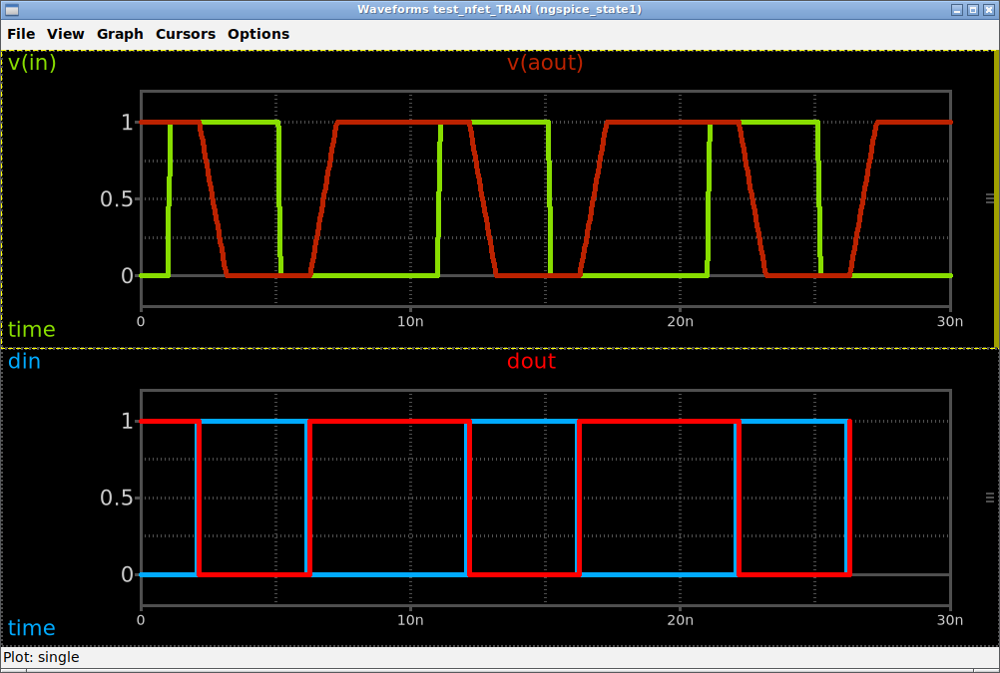

# M9 — the event VCD attaches beside the rawfile, and the nodes keep their ngspice names

**Measured 2026-09-15 by the driver, on both binaries, before Stage 12 was briefed** — `PLAN.md`
§12 says *"do it before writing the emission"*, and this is that.

The debt, verbatim: *does the `eprvcd` VCD attach cleanly through `ase::attach_dbs` **alongside** a
rawfile, and does the digital pane label the nodes with their ngspice names?*

## The answer

**Yes to both clauses, on apt 45.2 and on the fork.** Two more things the question did not ask
turned up, and **both change what Stage 12 must emit**:

1. ⚠ **The digital traces stop at the last event, not at the end of the run.** In the viewer,
   `din`/`dout` end at 26.3 ns while the analog strip runs to 30 ns — a held value drawn as if the
   signal ended.
2. ⚠ **`eprvcd` given an analog argument KILLS ngspice 45.2** — `*** buffer overflow detected
   ***`, rc 134, and no VCD at all. Event nodes only is safe on both binaries.

## The deck

The chain `evidence/xspice.md` measures, written fresh (the design of record's `../dor/mx.cir` no
longer exists):

```
* M9: adc_bridge -> d_inverter -> dac_bridge, the chain evidence/xspice.md measures
vin in 0 pulse(0 1 1n 0.1n 0.1n 4n 10n)
aadc [in] [din] adc1
.model adc1 adc_bridge(in_low=0.4 in_high=0.6)
ainv din dout inv1
.model inv1 d_inverter(rise_delay=1e-10 fall_delay=1e-10)
adac [dout] [aout] dac1
.model dac1 dac_bridge(out_low=0 out_high=1)
rload aout 0 1k
.control
tran 0.05n 30n
write mx.raw all
edisplay
eprvcd din dout > mx_evt.vcd
.endc
.end
```

`ngspice -b mx.cir`, rc **0** on both. `edisplay` answers the same on both:

```
List of event nodes in plot tran1
    node name           : type , number of events

    din                 : d    ,     7
    dout                : d    ,     7
```

`write mx.raw all` holds `time i(adac) v(aout) v(in) i(vin)` — **no `din`/`dout`**, re-confirming
`xspice.md` §7.6 on both — with **656** points on 45.2 and **662** on the fork (difference #7's
family). The VCD, 45.2's, in full:

```
$date September 15, 2026 08:08:40 $end
$version ngspice 45.2 $end
$timescale 1 fs $end
$var wire 1 ! din $end
$var wire 1 " dout $end
$enddefinitions $end
$dumpvars
0!
1"
$end
#2075000
1!
#2175000
0"
   … eight more …
#26174999
0!
#26275000
1"
```

No `$scope` at all, so `vcd_read()` joins zero scope levels and the names are bare
(`src/vcd_read.c:588-595`).

## Clause 1 — the attach, measured headless

`ase::attach_dbs <raw> tran [list <vcd>]`, then `xschem raw info` and a `raw switch` to each slot:

| | 45.2 | fork |
|---|---|---|
| return | `n 2 current 0 vcds <vcd> skipped {}` | the same |
| slot 0 | `tran`, 5 vars, **656** points: `time i(adac) v(aout) v(in) i(vin)` | `tran`, 5 vars, **662** points, same names |
| slot 1 | `vcd`, 3 vars, 25 points: **`time din dout`**, timescale `1e-15 s` | the same |

**Negative control:** the same call with a VCD path that does not exist returns
`n 1 current 0 vcds {} skipped <path>` — the missing file is reported as skipped, not attached.

## Clause 2 — the pane, measured on the dev display

A real viewer window on `:99` (Xvfb, openbox live), attached through **`wviewer::attach_raw`** —
the route `src/ase_window.tcl:3109` takes after a run, which calls `ase::attach_dbs` with
`ase::last_vcdfiles`. Two strips; `v(in)` and `v(aout)` added to the first, `din` and `dout` to
the second, by bare name, with no database named.



* **The legend reads `v(in)`, `v(aout)`, `din`, `dout`** — the ngspice names, unprefixed.
* `add_trace` returned `{}` (accepted) for all four; the trace model records `din` and `dout` with
  `rawfile <the vcd> sim_type vcd`, i.e. **resolved in the second database with no user action** —
  the spec §D1 foreign-DB path.
* The two strips share one time axis and the edges line up with the physics: `din` rises about
  1 ns after `v(in)` crosses 0.6 V (the `adc_bridge` default `rise_delay`), `dout` 0.1 ns after
  that, and `v(aout)` ramps from there over the `dac_bridge` default 1 ns.
* The fork's screenshot differs from 45.2's in **1012 pixels (0.15 %)**, which is the event times
  moving by up to 7.5 ps (below).

⚠ **A defect in the driver's own measurement script, recorded rather than quietly fixed.** Its
dump of each strip's traces printed **nothing** for the analog strip: it read a `rawfile` key that
a current-database trace does not carry, and the surrounding `catch` swallowed the whole loop.
That is failure mode 3 (an extractor that returns nothing), in a measurement rather than a suite.
**The screenshot is the evidence for the analog strip, not that line.**

## ⚠ Finding 1 — the digital pane stops at the last edge

In **every** variant measured (plain, `-a`, `-t 1p`, on both binaries) the VCD's last `#` is **the
last value change** — `#26275000` on 45.2, `#26267500` on the fork — and never the run's end at
30 ns. `vcd_read()` extends traces only to the file's own last timestamp (`src/vcd_read.c:818-823`,
DECISION 2), which here carries a change, so there is nothing to extend. **ngspice's own `plot`
pseudo-vector does extend to `CKTtime`** (`xspice.md` §7.5, `evtplot.c:266-268`); `eprvcd` does not.

The consequence is visible in the screenshot: `dout` goes to 1 at 26.3 ns and holds there until
30 ns, and the pane draws it **ending** at 26.3 ns. Nothing is unshowable, but a held value is
drawn as an absence. **Stage 12 owes a run end for the event database** — whether the reader
extends a VCD to the analog database's last time, or the emission supplies the end some other way,
is the crew's design; neither route was measured here.

## ⚠ Finding 2 — an analog argument to `eprvcd` aborts 45.2

| variant | 45.2 | fork |
|---|---|---|
| `eprvcd din dout` | rc 0, 330 bytes | rc 0, 329 bytes |
| `eprvcd -a din dout` | rc 0, 2 vars | rc 0, 2 vars |
| **`eprvcd din dout v(in)`** | ⚠ **rc 134, `*** buffer overflow detected ***: terminated`, VCD 0 bytes** | rc 0, 3 vars (`$var real 1 # v(in)`) |
| **`eprvcd -a din dout v(in)`** | ⚠ **rc 134, the same** | rc 0, 46 timestamps, last still `#26267500` |
| `eprvcd -t 1p din dout` | rc 0, `$timescale 1 ps` | rc 0, `$timescale 1 ps` |

**The trigger is the analog argument, not `-a`.** Three rules for the emission follow:

1. **Name only the nodes `edisplay` reported** — never an analog vector, even though the fork
   accepts one and writes a `real` variable for it.
2. **Emit `eprvcd` after `write`.** Measured: in the aborted run the rawfile had already been
   written and survived intact (656 points), so a crash costs the VCD and not the analog result.
3. **An abort here is `SIGABRT`** — `evidence/fork-dependencies.md` §5's B1 family, unprobeable by
   construction, because a probe would kill the run it rode in. It is avoided by construction
   (rule 1), not detected.

## Finding 3 — the timescale follows `TSTEP`, so `PLAN.md` §12's header was one deck's

`tran 0.05n 30n` writes `$timescale 1 fs` on both binaries, not the `1 ps` `PLAN.md` §12 quotes —
that figure came from a deck with a different step (the rule, `xspice.md` §7.3: one decade finer
than `TSTEP`, so ≥ 1 ns gives ps and anything finer fs). **`-t 1p` pins it** on both, at the cost of
truncating ticks (`#26275` / `#26267`). A golden must not pin the default header.

## Finding 4 — event times differ between the binaries; counts do not

All twelve timestamps move, by up to 7.5 ps (`#2075000` against `#2067500`, `#16175000` against
`#16167499`); events **7/7** and timestamps **12** agree. That is `binary-differences.md` **#3**,
re-confirmed on a second deck — **not a new row**. An event golden must not pin times.

## Not measured here

ASE-L **emitting** the line (Stage 12's work); the `.probe alli` refusal; the `trtol` caution; the
`dc` + auto-bridge failure (debt **M13**, still open with its reproducer and no root cause).
